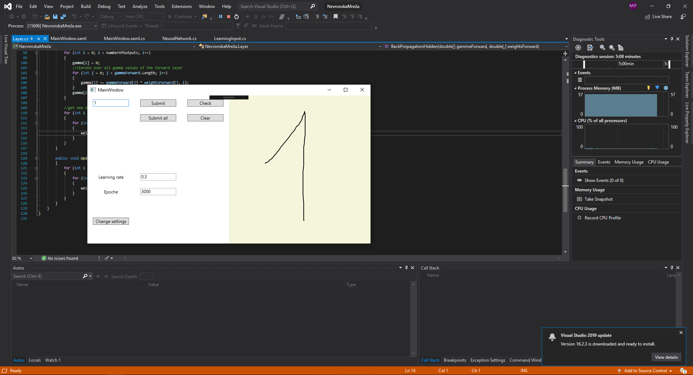

# WhichNumberIsThis_NeuralNetwork
## Neural network for guessing which number the user drew based on previous input

With the current configuration you can input 6 numbers, if you'd like more or less, you need to change the number of neurons in the ouput layer. To do so change the last number in the following code. The numbers here are the number of neurons in a given layer. You can also change the learnign rate and epoch in the user interface.

```
NeuralNetwork net = new NeuralNetwork(new int[] { 20, 25, 25, 6});
```

To use this application, first you're going to need to provide it some input data. Draw a number from 1 to 6 on the right canvas, input which number it is in the top left corner and submit. Repeat for all numbers, you can submit different drawings of the same number. When you'finished, click submit all to pass the learning data to the neural network. 

Now draw a number and click on Check, it should guess which number you drew.


